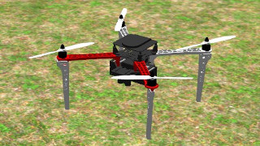
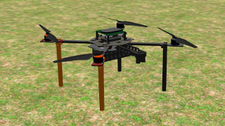

# MRS Gazebo Simulation


| Simulation build status | [](https://github.com/ctu-mrs/simulation/actions) | [](https://github.com/ctu-mrs/simulation/actions) |
|-------------------------|-------------------------------------------------------------------------------------------------------------------------------------|------------------------------------------------------------------------------------------------------------------------------------|

## Submodules

| ROS Package                                                                           | 18.04                                                                                                                                                                 | 20.04                                                                                                                                                                |
|---------------------------------------------------------------------------------------|-----------------------------------------------------------------------------------------------------------------------------------------------------------------------|----------------------------------------------------------------------------------------------------------------------------------------------------------------------|
| [mrs_simulation](https://github.com/ctu-mrs/mrs_simulation)                           | [](https://github.com/ctu-mrs/mrs_simulation/actions)                           | [](https://github.com/ctu-mrs/mrs_simulation/actions)                           |
| [mrs_gazebo_common_resources](https://github.com/ctu-mrs/mrs_gazebo_common_resources) | [](https://github.com/ctu-mrs/mrs_gazebo_common_resources/actions) | [](https://github.com/ctu-mrs/mrs_gazebo_common_resources/actions) |
| [px4](https://github.com/ctu-mrs/px4_firmware)                                        | [](https://github.com/ctu-mrs/px4_firmware/actions)                               | [](https://github.com/ctu-mrs/px4_firmware/actions)                               |
| [mavlink_sitl_gazebo](https://github.com/ctu-mrs/px4_sitl_gazebo)                     |                                                                                                                                                                       |                                                                                                                                                                      |

## System requirements

Required OS is Ubuntu 20.04 LTS 64-bit (Ubuntu 18.04 LTS 64-bit) or its flavors that can install ROS Noetic (ROS Melodic).
The suggested variant of OS installation is dual boot instead of virtualization that can be slow and can not handle well the simulation GUI.
We use [Gitman](https://github.com/jacebrowning/gitman) to manage the repository **submodules**.
The repository are supposed to be compiled by [catkin tools](https://catkin-tools.readthedocs.io).

## Unmanned Aerial Vehicles

| Model        | Spawn argument | Simulation                    |
|--------------|----------------|-------------------------------|
| DJI f330     | `--f330`       |  |
| DJI f450     | `--f450`       |  |
| Holybro x500 | `--x500`       |  |
| DJI f550     | `--f550`       |  |
| Tarot t650   | `--t650`       |  |
| NAKI II      | `--naki`       |  |

## Examples of tmuxinator simulation sessions

Selected tmuxinator scripts:

- [example_tmux_scripts/one_drone_gps](example_tmux_scripts/one_drone_gps)
- [example_tmux_scripts/one_drone_gps_standalone](example_tmux_scripts/one_drone_gps_standalone)
- [example_tmux_scripts/one_drone_optic_flow](example_tmux_scripts/one_drone_optic_flow)
- [example_tmux_scripts/two_drones_gps](example_tmux_scripts/two_drones_gps)

Bare tmux script (similar to the one used on real UAVs):

- [example_tmux_scripts/just_flying_bare_tmux](example_tmux_scripts/just_flying_bare_tmux)

For detail description of script capabilities for spawning vehicles see [mrs_simulation](https://github.com/ctu-mrs/mrs_simulation).

## Installing simulation

Install the whole [MRS UAV system](https://github.com/ctu-mrs/mrs_uav_system).

## Finishing your .bashrc

The `install.sh` script will add the following to your .bashrc:
```bash
source /opt/ros/<ros_version>/setup.bash
source /usr/share/gazebo/setup.sh
```
## UPDATE BY JOSEPH MANJAPPILLY (josjoy94@gmail)

# Localization of Unmanned Aerial Vehicles in Forestry Robotics Applications
![image1]

JOSEPH MANJAPPILLY (josjoy94@gmail)

# Unmanned Aerial Vehicle


# System properties

- The platform iS built using Robot Operating System (Melodic, Noetic),ROS(2)
# Installation Steps

##### Step 1 : Set up Gazebo simulation forestry environment
To install Gazebo, run 
`curl -sSL http://get.gazebosim.org | sh` in your terminal
Test your installation by running the command `gazebo` on your terminal to make sure the simulator launches with no errors. If everything is fine, you can then just run CTRL+C in the terminal and proceed to the next step

##### Step 2  : Setting up and using forest models
`git clone https://bitbucket.org/semfire-isr-uc/semfire_gazebo_simulator.git`
- From inside the repository, run the following command to copy the Models folder to the .gazebo folder:

`cp -r Models ~/.gazebo`

- add that path to your .bashrc with:

`GAZEBO_MODEL_PATH=~/.gazebo/Models$GAZEBO_MODEL_PATH' >> ~/.bashrc`

#### Step 3 : Automatic Installation of MRS_UAV Package

```
sudo apt install lsb-core gnupg
cd /tmp
echo '
GIT_PATH=~/git
mkdir -p $GIT_PATH
cd $GIT_PATH
sudo apt -y install git
git clone https://github.com/ctu-mrs/mrs_uav_system
cd mrs_uav_system
git checkout master
git pull
./install.sh -g $GIT_PATH
source ~/.bashrc' > clone.sh && source clone.sh
```

This installation script will set everything up:

- install https://semfire-core.slite.page/app/docs/gJT6gbaOu_;

- install other dependencies such as git, gitman, etc.;

- clone uav_core, simulation, example_ros_packages into ~/git;

- install more dependencies such as tmux and tmuxinator;

- create ros workspace in ~/mrs_workspace for the uav_core and simulation;

- create a ros workspace in ~/workspace for examples;

- link packages to the workspaces;

- compile the workspaces;

- added configuration lines into your ~/.bashrc.


## Modifications 

I have made modifications in `~/mrs_workspace/src/simulation/example_tmux_scripts/one_drone_gps & ~/mrs_workspace/src/simulation/example_tmux_scripts/three_drone_gps` inorder to run it with f550 uav type.

##### Step 1
 Copy the required .world files from semfire_gazebo_simulator to the MRS UAV Sytem
 
 `cp -r low-density-forest-30by30.world ~/mrs_workspace/src/simulation/ros_packages/mrs_gazebo_common_resources/worlds`
 
##### Step 2 
Create a new pos.yaml file. You can specify the initial position of drone in simulation using --pos_file parameter

```
cd  ~/mrs_workspace/src/simulation/example_tmux_scripts/one_drone_gps
nano pos.yaml
```
Copy below parameters to the newly created yaml file.
```
uav1:
  id: 1
  x: -20 
  y: 1
  z: 1
  heading: 1
 ```

{The Negative value for x is used to spawn the UAV outside of the simulated forest}

##### Step 3
Open the session.yaml file from your workspace
```
cd ~/your_workspace/src/simulation/example_tmux_scripts/one_drone_gps
nano session.yaml
```

#### Step 4: Edit the below parameters
- Change the UAV type to f550 and edit the UAV_NAME as shown below

`pre_window: export UAV_NAME=uav1; export RUN_TYPE=simulation; export UAV_TYPE=f550; export WORLD_NAME=simulation; export SENSORS="garmin_down"`

- Change the world files. You can choose any .world files, for example

`- waitForRos; roslaunch mrs_simulation simulation.launch world_name:=low-density-forest-30by30 gui:=true`

- Use below command for spawning the uav with required sensor and pos file
`rosservice call /mrs_drone_spawner/spawn "1 f550 --enable_rangefinder --enable_realsense_front --pos_file `pwd`/pos.yaml" `

#### Run the Simulation
`./start.sh`
