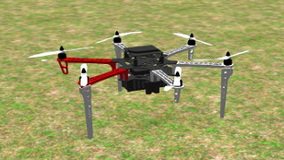

# MRS Gazebo Simulation [](https://github.com/ctu-mrs/simulation/actions)


## Submodules

| ROS Package                                                                           | Build status                                                                                                                                                     |
|---------------------------------------------------------------------------------------|------------------------------------------------------------------------------------------------------------------------------------------------------------------|
| [mrs_simulation](https://github.com/ctu-mrs/mrs_simulation)                           | [](https://github.com/ctu-mrs/mrs_simulation/actions)                           |
| [mrs_gazebo_common_resources](https://github.com/ctu-mrs/mrs_gazebo_common_resources) | [](https://github.com/ctu-mrs/mrs_gazebo_common_resources/actions) |
| [px4](https://github.com/ctu-mrs/px4_firmware)                                        | [](https://github.com/ctu-mrs/simulatirewarmoif_4xpn                              |
| [mavlink_sitl_gazebo](https://github.com/ctu-mrs/px4_sitl_gazebo)                     |                                                                                                                                                                  |

## System requirements

Required OS is Ubuntu 18.04 LTS 64-bit or its flavors that can install ROS Melodic.
The suggested variant of OS installation is dual boot instead of virtualization that can be slow and can not handle well the simulation GUI.
We use [Gitman](https://github.com/jacebrowning/gitman) to manage the repository **submodules**.
The repository are supposed to be compiled by [catkin tools](https://catkin-tools.readthedocs.io).

## Unmanned Aerial Vehicles

| Model      | Spawn argument | Simulation                    |
|------------|----------------|-------------------------------|
| DJI f450   | `--f450`       |  |
| DJI f550   | `--f550`       |  |
| Tarot t650 | `--t650`       |  |

## Examples of tmuxinator simulation sessions

Selected tmuxinator scripts:

- [example_tmux_scripts/one_drone_gps](example_tmux_scripts/one_drone_gps)
- [example_tmux_scripts/one_drone_gps_standalone](example_tmux_scripts/one_drone_gps_standalone)
- [example_tmux_scripts/one_drone_optic_flow](example_tmux_scripts/one_drone_optic_flow)
- [example_tmux_scripts/two_drones_gps](example_tmux_scripts/two_drones_gps)

Bare tmux script (similar to the one used on real UAVs):

- [example_tmux_scripts/just_flying_bare_tmux](example_tmux_scripts/just_flying_bare_tmux)

For detail description of script capabilities for spawning vehicles see [mrs_simulation](https://github.com/ctu-mrs/mrs_simulation).

## Installing simulation

Install the whole [MRS UAV system](https://github.com/ctu-mrs/mrs_uav_system).

## Finishing your .bashrc

The `install.sh` script will add the following to your .bashrc:
```bash
source /opt/ros/melodic/setup.bash
source /usr/share/gazebo/setup.sh
```
